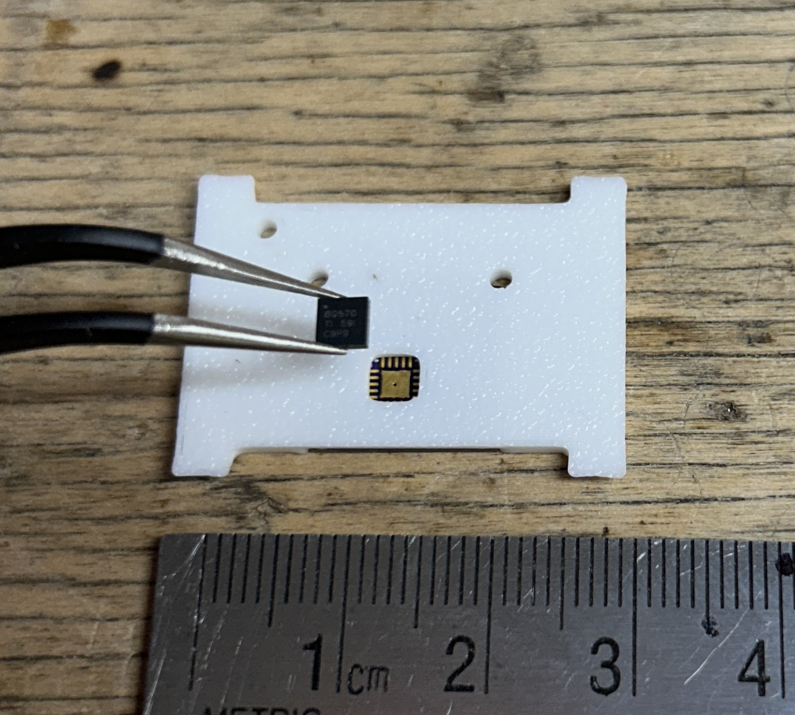
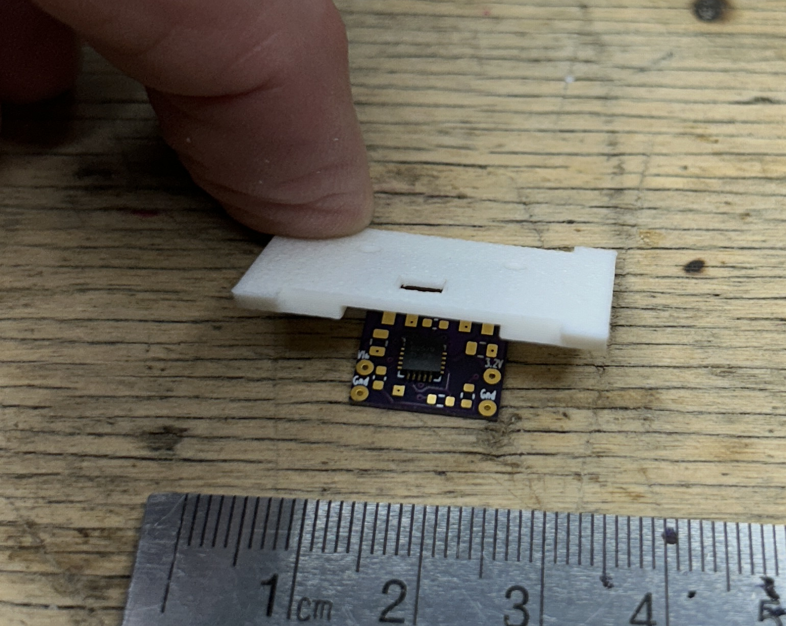
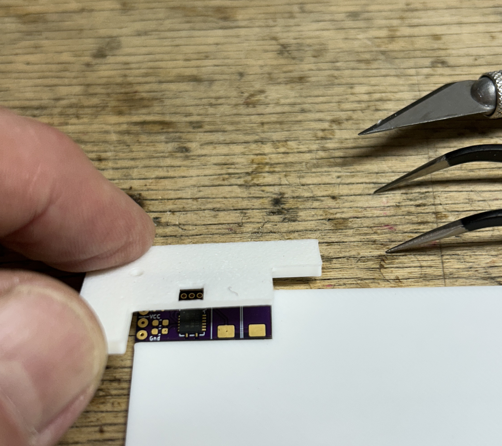

# 3D Printed Jig for Placing SMDs on Small PCBs

## About

This jig aligns an SMD when you hand place it on a small PCB.
The jig is 3D-printed. 
The repository contains the FreeCAD design files.
The design is parametric, so you can customize the jig for your PCB.

The jig has apertures(holes) in which you drop SMD ICs.
The apertures are the same shape, but slightly (0.07 mm on each side) 
larger than their corresponding ICs.
The apertures are the size of the body of a no-lead SMD,
or a size that includes the pins, for SMDs having leads for pins.
The jig holds a solder pasted PCB beneath the holes.
The jig helps position each IC over its pasted lands.
The jig does not compensate for PCB or package inaccuracies.

The jig has beveled ears/handles so you can tilt it up over the pasted ICs 
and remove the PCB.

### Variations

The design has two variations:

1. with a notch to hold the PCB
2. with two L-shaped bodies that hold the PCB

The first variation has a tolerance around the PCB,
so it holds the PCB looser and with less accuracy.
The second variation seems to hold the PCB with more accuracy.

Each variation is a separate body in the FreeCAD design
but they share the spreadsheet and some sketches.

The second variation also requires a lower-right(LR) body
from a [solder pasting jig](https://github.com/bootchk/SolderPastingJig).
The second variation also has holes in the corners of the
aperture for the IC, so you don't need to square up the corners.
You still need to check that the aperture for the IC
lets the IC fall through and does not bind the IC when tilting the jig.

## Demonstration

Placing a chip in the jig.  The PCB would normally be pasted already.  The aperture has not been trimmed yet and has rounded corners.

Rocking up the jig to remove the PCB.  If you zoom in, you can see the chip is not placed perfectly, but slightly twisted.  It probably will reflow correctly.  The jig is fiddly to prepare, and you must still use care.  But things seem to go wrong less often than without the jig.

The PCB is a [power supply for a solar mobile artwork](https://github.com/bootchk/BQ2r2) (Solabile), using a TI BQ25570 energy harvester IC.
The PCB takes nine more discretes, which I hand place after placing the one IC using the jig.

This is the second variant, where the jig is L-shaped and presses the PCB
against a separate L-shape pinned to the work surface.
It seems better than the first variant
but is still fiddly and could use more improvements.

## Context

You are placing chips on PCB boards by hand.
You use tweezers or a vacuum pen.
You don't have a pick-and-place machine.
You are building small boards a few centimeters on a side.
You are only placing a few ICs.

It is hard to place ICs with fine-pitched, small pins.
This jig helps you place such chips.

It is easy to hand place discrete components as small as 0603.
There is much tolerance for placing them.
The reflowed solder pulls the components into alignment
via surface tension.

## Why use this jig

For a few boards, it suffices to hand place without a jig.
For batches of a few dozen, this design may save time and produce fewer reflow failures.
You trade off preparing this jig with time spent reworking failed solder joints.

Hand placing without this jig requires concentration and a steady hand.
The pitfalls are many.
If your hands are not steady, whether an IC exactly aligns is a matter of chance.
You might drop an IC misaligned and then need extra work to nudge it back into position.
If you drop an IC far from alignment, you may smear the solder paste while nudging the IC, reducing the chance that the solder will reflow properly.
If you drop an IC entirely wrong, it might smear the solder paste for other ICs, and the IC might get smeared with solder paste

With this jig:
- when you drop an IC misaligned, the aperture might guide it into alignment
- when you are nudging, the aperture keeps you from nudging too far
- when you drop an IC in totally wrong place, it falls on top of the jig and won't smear any solder paste

With this jig, you still might drop an IC wrong.
It sometimes happens that only one corner or side of the IC is in the aperture.
You still might need to nudge the IC into the aperture.
But the aperture also guides your nudging.

## A strategy behind this jig

As with many endeavors, you should attempt the hardest things first,
the things most likely to fail.
That way, if you fail, you have not wasted time doing things that are not likely to fail.

In placing SMD parts on a PCB, the thing most likely to fail,
requiring the most care, is placing fine-pitched ICs.
This jig requires you to do that first,
and then you place the easy parts by hand.

## Related

See [a jig for pasting a PCB for SMD devices](https://github.com/bootchk/SolderPastingJig)

The second variation works with the lower right body of that pasting jig.

## Status and caveats

This design is experimental and has been tested only lightly. 
Try it to see whether it saves you aggravation.

I have tested it on only two boards, and QFN no-lead packages. 
In those tests:

- It was relatively straightforward to parameterize.
- It worked without adjustments for variations in fabrication accuracy.

I have not tested many boards.
I have not tested the jig works with leaded pin packages,
but I expect it will.
The parameter flow may not work correctly for every design.

#### Only one IC
The design only has one IC.
The design does not have apertures for discretes (which I place by hand.)
You can modify the FreeCAD design 
if you want to place more ICs
or want to place discretes using the jig.

#### Only for small PCBs
The jig works for small PCBs, say a few centimeters on a side.

It might work for larger ICs, but it might not not tilt up properly.

#### Only for short IC components
The jig works for ICs whose height is about 1 mm.
The jig won't tilt to clear taller components, such as inductors or large capacitors.

## Using this jig

The broad steps are:

- customize the design for your board.
- print and check the jig alignment
- trim the apertures of the jig
- use the jig to place ICs.

### Customizing the FreeCAD design for your board

To make a jig for another board, copy the FreeCAD file and update the spreadsheet
parameters.

1. Measure the required distances in your PCB CAD software (for example, KiCad).
2. Get component dimensions from the component's datasheet
3. Enter those measurements in the FreeCAD design spreadsheet.

See [details](#how-to-customize-the-freecad-design-for-your-board)

### How to print the jig and check alignment

1. Export the jig body from FreeCAD (select the last item in the tree model and choose the menu item "File>Export" to create e.g. a .3mf file.)
The usual item name is "PocketCornerHoles"
and the usual created file is "SMDPlaceJig-BodyPocketCornerHoles.3mf"
2. Open the file in your choice of slicer app.  Before slicing, reorient the jig so that the jig's top surface is against the printer's build plate/bed.
3. Slice and print the jig.
4. Slide the jig over an unpasted PCB and check the alignment.
The outline (printed on the silkscreen layer) of each IC should be centered in its corresponding aperture.

If an IC does not align with its aperture, check for:

- Incorrect dimensions from the KiCad PCB design.
- An inaccurately cut PCB edge.
- PCB not fully seated upwards in the jig
- Other inaccuracies in the PCB or jig fabrication.

### How to trim apertures of the jig

Use a sharp knife to square up the edges of the apertures.
The goal is that an aperture lets a component IC fall through it.
You should dry run (dropping ICs onto an unpasted board)
to ensure that an IC drops all the way to the PCB without binding,
in other words not pinched by the jig.
Test that the jig will tilt up without catching the ICs
and pulling them up off the PCB.

You need to trim apertures because 3D printers are not accurate enough
for holes the size of some small component ICs.
The apertures might have rounded corners.
The apertures might be too small because the plastic shrinks
(although the parameter *ICHoleTolerance* partly accounts for that.)
The aperture walls might not be orthogonal because the layer printed on the bed squeezes out.

### How to use the jig to place components

1.  Have on hand the PCBs, components, and a chip orientation diagram.
(The jig has no marks for pins #1, and obscures marks on the PCB silkscreen.)
2.  Paste the PCBs with solder paste.
3.  Place a PCB in front of you on a work surface.
Place the jig further away on the work surface.
4.  Slide the jig towards you over the PCB.
The corners of the PCB should appear in two holes of the jig.
5.  Check alignment.
The outline of the IC on the silkscreen should be centered in its aperture.
6.  Pick up an IC, oriented properly, and drop it in its aperture.
Hold the IC inside the aperture, down as far as having its topside flush with the top
surface of the jig.
The underside of the IC will then be 0.4mm above the paste, for 1 mm high components.
Now release the IC.
7.  Ensure the IC is level and fully contacting the paste on the PCB board.
The top surface of the component should be level,
and 0.4 mm below the top surface of the jig, for 1 mm high components.
If not, nudge it down into the aperture.
8.  After placing all chips: put your finger on the upper left handle
and rock the jig back on its far edge, tilting the jig up towards you.
You must tilt it up since the apertures must lift over the chips.
The jig will no longer slide over the board without hitting the chips.
The IC sticks to the paste and should resist uplift by the jig.
9.  Remove the PCB away from the jig.

Proceed to place other components by hand and reflow the PCB.

## How to customize the FreeCAD design for your board

Customize the jig for each PCB design.
To customize the design, change the design's spreadsheet parameters.

The design in the repository was made with FreeCAD v1.0.2.
You might be able to import it into other CAD apps.

### Data flow in the FreeCAD design

Main sketches are in a group (folder) of the document.

- PCB rect
- IC rect
- relief holes at the corners of the IC

There is a separate body for each variant.
You only need print the one you want to try.

The design's spreadsheet controls the dimensions of most sketches.

Each body also has sketches early in the model tree.
The design carbon copies (references) sketches into the pads and pockets in the body of the jig.

### Important parameters changed for each PCB board

You measure these from the KiCad design of the PCB.

You should change the grid precision to 0.05 mm in KiCad.
Every 0.05 mm is significant when working with fine-pitched ICs.
When measuring, you should move the cursor to the center of line graphics.

To make a measurement,
move the cursor to the UL corner of the line graphic of the PCB edge outline and click,
then press the spacebar.
This changes the origin of the dimensions shown in the status bar.
Then move the cursor to another line graphic location and read
the delta X and delta Y from the status bar.

PCB dimensions:

- *PCBWidth*
- *PCBLength*
- *PCBHeight* (Currently set for thin boards that are 0.8 mm thick. This affects
  the jig height.)

The IC's width and length, from the datasheet of the IC:

- *ICWid*
- *ICLen*

Distances from the PCB's UL corner to the IC's UL corner, 
from the KiCad design of the PCB.  
Measure to just inside the upper left (UL) corner of the ink of the outline of the IC package on the silkscreen layer.
You should check the KiCad footprint shows the ink for the package outline as described,
so that the inner edge of the ink meets the outer edge of the package.

- *ICOffsetX*
- *ICOffsetY*

Tweaks.  Change these if you think all other parameters are accurate, 
but the apertures still are not centered on the lands for an IC.
I am not sure why these are needed.
One explanation might be that they correct for inaccurate cutting of the PCB board edge.

- *ICHoleAdjustX*
- *ICHoleAdjustY*

### Lesser Parameters

You rarely need to change these parameters.

#### PCBTolerance

This is the room the jig allows around (on each side of) the PCB so that
you can slide the PCB under the jig
and so that the jig tilts up leaving the PCB on the work surface.

See the parameter *PCBTolerance*

This parameter is unfortunately needed
because the PCB slides into a notch
and the jig must clear the PCB to tilt up over the IC components.
When this jig is integrated with the pasting jig,
this parameter might be reduced.
Instead, the PCB will be clamped loosely between two bodies,
and this jig will have an L-shape to hold the PCB,
instead of a notch.
The jig will still need to be tilted,
but fewer edges of the jig can catch the PCB.

#### IC package tolerance
The jig has apertures for ICs that are this much larger than the actual IC package,
on each side.
This lets the packages fall through the apertures with binding,
and lets the jig lift up without catching the ICs.

See the parameter *ICHoleTolerance*

#### Paste thickness
The jig assumes a paste thickness of 3 or 4 mil (roughly 0.08 or 0.1 mm).
This is the usual recommended paste thickness.
This is the thickness a usual stencil leaves.
The jig might not clear the paste if you dab on paste with a toothpick.
See the *PasteHeight* parameter.

#### Jig clearance from paste
The bottom surface of the aperture plate is 0.4 mm
above the paste.
This value was determined by guesswork.
It seems to clear the paste when you slide the jig over the PCB.
See the *PasteClearance* parameter.

#### Component height

The jig allows components about 1 mm height.
This determines the thickness of the plate with apertures above the PCB.
See the *'ComponentHeight* parameter.

The height of the jig is the sum
*PCBHeight + PasteHeight + PasteClearance + ComponentHeight*

#### Jig margin

This is the width of the jig's frame around the PCB. This is somewhat
arbitrary and rarely needs to change.

See the *FrisketWidth* parameter.

There are more lesser parameters in the spreadsheet, not discussed here.
The jig has pinhole so you can pin it to a worksurface.

### Coordinate system

The coordinate system origin in the FreeCAD design
is at the center of the PCB. 
This matters only if you
are reading the spreadsheet formulas or making substantial changes to the
FreeCAD design.

## Tolerances

Jig performance depends on several tolerances:

- 3D-printer accuracy.
- PCB-fabrication accuracy.
- IC packaging accuracy
- The accuracy of your measurements of the IC locations

PCB edge cutting appears to be the least accurate step. If the board edge is cut
incorrectly, the jig may not align.

The parameters currently use approximately 0.05 mm precision (one or two digits
after the decimal point). You can enter more precise values, but doing so may
not help unless the fabrication and measurement processes are equally precise.

I have found that generally a 3D printer is accurate to about 0.05 mm. 
Accuracy may be worse, on different printers or plastics.
Some plastics shrink significantly as they cool.

This design appears to work with pads as small as 0.3 mm.

The design allows 0.05 mm tolerance for centering the PCB loosely
and 0.07 mm tolerance for centering the IC loosely in the aperture.
So loosely speaking the expected maximum error is 0.12 mm,
which is 40% of a 0.3 mm pin and land.
So an IC pin placed with this jig might overlap its land by only 60%.
This is the worst case, when the PCB and aperture are in error in opposite directions.
More typically, the errors will counteract and the total error will be less.
Any inaccuracies in fabrication of the PCB add to the error;
the 0.12 mm error estimate is not a complete upper bound.

This total error is likely to be as small as you can achieve placing
ICs by hand without the jig.
And again, the SMD reflow process allows for such errors.
